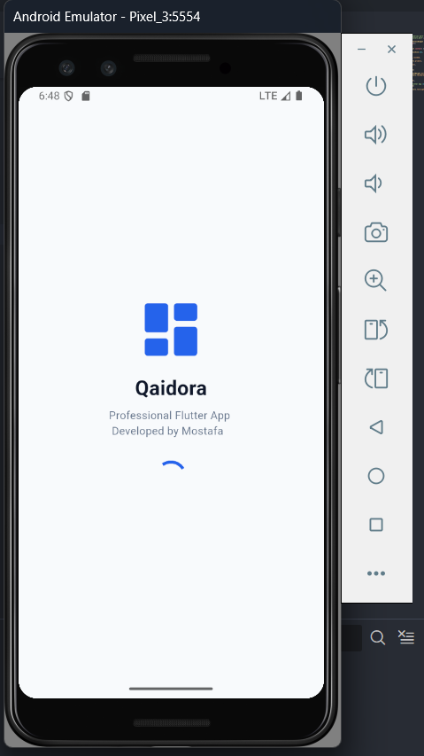

# Flutter Business Management Assignment 3

[](https://flutter.dev/)
[](https://dart.dev/)
[](LICENSE)

This project is a **Flutter application** demonstrating a modern and professional UI design for a **Business Management App**, featuring a **Splash Screen** and a **Home Dashboard**.

---

📱 **App Overview**

The application contains:

- **Splash Screen**:  
  - Gradient background  
  - Centered app logo with circular design  
  - App name, tagline, and developer credit  
  - Circular loading indicator  

- **Home Screen**:  
  - Grid of department cards:  
    - Sales 🧾  
    - Purchases 📦  
    - Products 🗂  
    - Customers 👥  
    - Suppliers 🏭  
    - Settings ⚙️  
    - Profile 👤  
  - Professional color theme using `AppColors`  
  - Reusable `HomeCard` widget for each department  
  - Responsive and clean UI for multiple screen sizes  

---

### App Screenshots

#### Splash Screen
<p align="center">
  
</p>

#### Home Screen
<p align="center">
  
</p>

---

🛠️ **Technologies Used**

- Flutter  
- Dart  
- Material Design  
- GridView for department cards  
- Custom widgets (`HomeCard`, `AppLogo`)  
- Centralized color theming with `AppColors`  

---

🚀 **How to Run the Project**

```bash
git clone https://github.com/MostafaTonin/assignment3.git
cd assignment3
flutter pub get
flutter run
